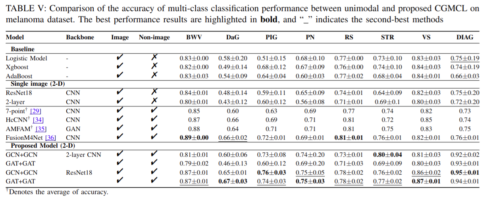

## Enhancing Multimodal Medical Image Classification using Cross-Graph Modal Contrastive Learning


### 📌 Project Description


<p align="center">
    
</p>


### 🔧 Installation
1. Clone the repository:
   ```bash
   git clone https://github.com/your_username/CGMCL.git
   cd CGMCL
   ```
2. Install dependencies:
   ```bash
   pip install -r requirements.txt
   ```

---


# Download processed data

Processed data data file can be download from Lab google drive [Here](https://drive.google.com/drive/folders/1sVXPrlPsoUC1BwYkAmaTDnDnRmZxt0zr?usp=drive_link)

Raw melanoma dataset can be found at 7-point criteria evaluation Database :point_right: [Here](https://derm.cs.sfu.ca/Welcome.html)


---

### 📂 Directory Structure
```
CGMCL/
|── dataset_skin
|   │──clinical_images/
|   │──dermatology_images/
|   │──meta_features/
│   │──skin_labels/
│── data_handler/
│   │── load_dataset.py  # Load dataset utilities
│── losses.py             # Loss functions implementation
│── main.py               # Main script to train/evaluate the model
│── model_resnet_skin.py  # ResNet model for skin classification
│── requirements.txt      # Dependencies list
│── run_exp_skin_v1.sh    # Shell script to run experiments
│── utils.py              
```

---

To run the training script with configurable parameters:

```bash
python main.py \
    --img_data_dir <path_to_images> \
    --skin_type <skin_type> \
    --model_select <model_name> \
    --losses_choice <loss_function> \
    --dataset_choice <dataset_name> \
    --category <category> \
    --n_epoch <number_of_epochs> \
    --n_classes <number_of_classes> \
    --exp_mode <experiment_mode> \
    --beta <beta_value> \
    --margin <margin_value>
```

Example:
```bash
python main.py \
    --img_data_dir ./dataset_skin/ \
    --skin_type skin \
    --model_select resnet_18 \
    --losses_choice cross_entropy \
    --dataset_choice dermatology_images \
    --category STR \
    --n_epoch 300 \
    --n_classes 3 \
    --beta 0.5 \
    --margin 1.0
```

For running experiments:

```bash
bash run_exp_skin_v1.sh
```

### 📊 Experimental Results

Below is a comparison of multi-class classification performance between unimodal and proposed CGMCL on the melanoma dataset:

<p align="center">
    
</p>

### Welcome to cite our paper from our research paper

```
@article{ding2024enhancing,
  title={Enhancing multimodal medical image classification using cross-graph modal contrastive learning},
  author={Ding, Jun-En and Hsu, Chien-Chin and Liu, Feng},
  journal={arXiv preprint arXiv:2410.17494},
  year={2024}
}
```

---


### 📝 License
This project is licensed under the MIT License.

---

### 📬 Contact

Welcome to contact the [author](https://www.jun-ending.com/) at jding17@stevens.edu or collaborations if you have any questions about using the code. Note that experimental performance may vary slightly due to differences in computer hardware and environment.